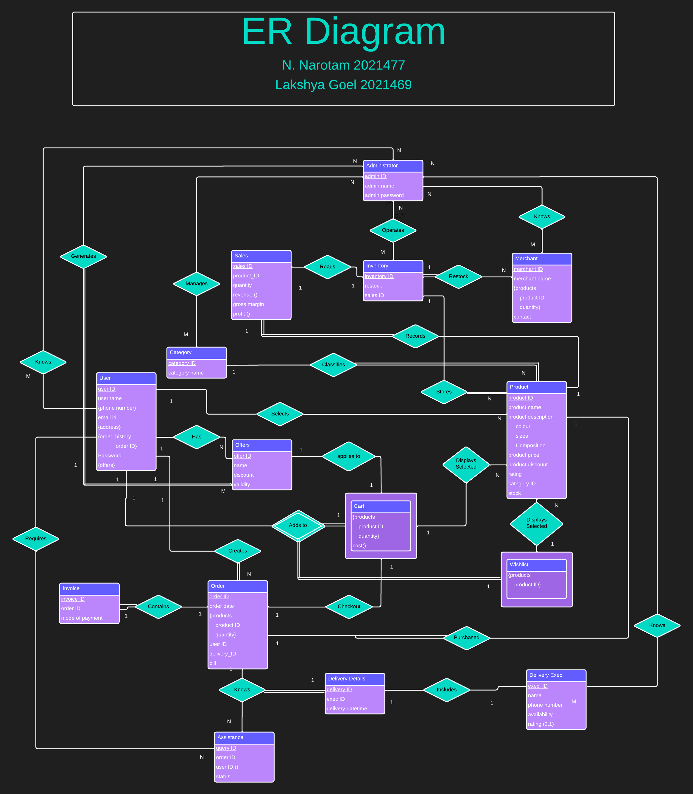

# OKINA

ŌKINA is a comprehensive online retail solution that offers a fully functional backend and a minimalistic front end, providing all the capabilities needed for a seamless online shopping experience. With a focus on simplicity and efficiency it can be scaled to empower businesses

The individual data set generated for each table is submitted within the
folder named **table_data**

## Database Schema:
A total of 23 tables (or relations) are created using standard SQL
commands. These include tables for strong entities, weak entities,
relationships and multi-valued attributes. An SQL file - tables.sql contains
all the queries used in the process.

## DDL
The tables, triggers and other definitions for the database are written in DDL.sql\
Running tables.sql will generate the entire database filled with appropriate values that can be worked on

## Integrity constraints:
All the necessary constraints in DDL are added to the aforementioned
tables. These constraints include but are not limited to primary key, foreign
key, not null, unique and check.

## ER Diagram
